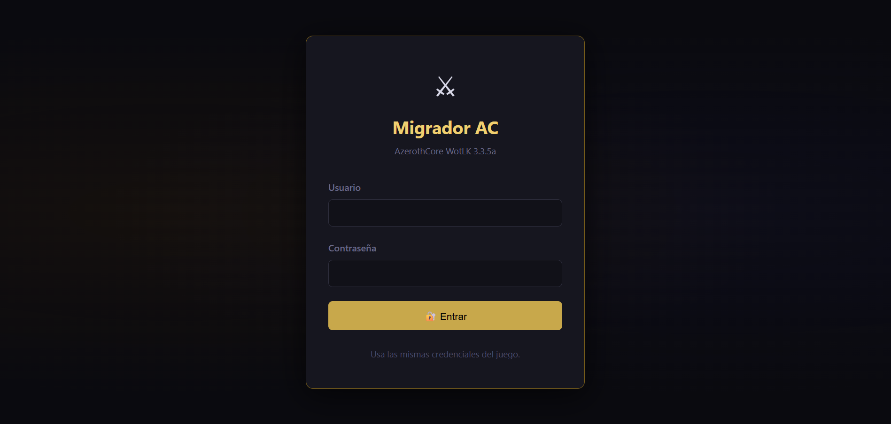

# ⚔ Migrador de Personajes — AzerothCore

Herramienta web para migrar personajes hacia un servidor **AzerothCore WotLK 3.3.5a**.  
Versión actualizada y modernizada desde el repositorio original:  
[azerothcore/web-character-migration-tool](https://github.com/azerothcore/web-character-migration-tool)

> **PHP 8.5.7 ya está incluido** en la carpeta `php/`. No necesitas instalar nada adicional.



---

## Inicio rápido

1. Importa las tablas SQL (solo la primera vez):
   ```
   mysql -u acore -p acore_auth < sql/install.sql
   ```
2. Edita `config.php` con tus credenciales de base de datos y SOAP.
3. Doble clic en **`Iniciar.bat`** — levanta el servidor y abre el navegador automáticamente en `http://localhost:8080`.
4. Para detenerlo: cierra la ventana de consola o ejecuta **`Detener.bat`**.

---

## 📋 Requisitos

| Componente | Estado |
|-----------|--------|
| PHP 8.5.7 | **Incluido** en `php/` — no requiere instalación |
| MySQL 8.0+ / MariaDB 10.5+ | Requerido (AzerothCore) |
| AzerothCore | Última revisión (`acore_auth` / `acore_characters`) |
| Addon WoW | `chardump` (incluido en `addon/chardump/`) |
| DBC | `server/dbc/ItemDisplayInfo.dbc` (para íconos de items) |

---

## 🚀 Instalación

### 1. Base de datos

```bash
mysql -u acore -p acore_auth < sql/install.sql
```

Crea:
- `account_transfer` — registro de todas las transferencias
- `account_transfer_blacklist` — cuentas bloqueadas
- `v_transfer_summary` — vista de resumen para reportes
- `migrador_login_attempts` — intentos de login fallidos, para el rate limiting por IP

### 2. Configuración

Edita **`config.php`** con tus datos:

```php
define('DB_AUTH_HOST', '127.0.0.1');
define('DB_AUTH_USER', 'acore');
define('DB_AUTH_PASS', 'acore');
define('DB_AUTH_NAME', 'acore_auth');

define('REALMS', [
    1 => [
        'name'      => 'Mi Servidor',
        'db_name'   => 'acore_characters',
        'soap_host' => '127.0.0.1',
        'soap_port' => 7878,
        'soap_user' => 'admin',
        'soap_pass' => 'admin',
        'soap_uri'  => 'urn:AC',   // ← AC usa urn:AC (no urn:TC)
    ],
]);
```

### 3. Worldserver — Habilitar SOAP

En `worldserver.conf`:

```ini
SOAP.Enabled  = 1
SOAP.IP       = 127.0.0.1
SOAP.Port     = 7878
```

### 4. Pre-cachear íconos (recomendado)

Primero asegúrate de que `DBC_PATH` en `config.php` apunte a la carpeta que contiene `ItemDisplayInfo.dbc`:

```php
define('DBC_PATH', 'C:/AzerothCoreRepack/server/dbc');  // ← ajusta esta ruta
```

Luego ejecuta una sola vez:

```bash
php api/precache_icons.php
```

O desde el navegador: `http://localhost:8080/api/precache_icons.php`

Procesa los ~46 000 items de `item_template` en ~75 s y genera `storage/icon_cache/`.  
Para forzar reconstrucción: `?reset=1`

> `ItemDisplayInfo.dbc` lo extrae AzerothCore automáticamente con el extractor de datos del cliente de WoW.

---

## 🔑 Cómo iniciar sesión

Los jugadores usan las **mismas credenciales del juego** (cuenta de AzerothCore).  
El hash de contraseña es `SHA1(USUARIO:CONTRASEÑA)` en mayúsculas — compatible directamente con `acore_auth.account`.

---

## 🗺 Flujo de transferencia

```
Jugador                    Web                      GM
   │                        │                        │
   │── Login ──────────────>│                        │
   │── Paso 1: sube dump ──>│ Valida formato JSON    │
   │<── Paso 2: Character ──│ Paperdoll + íconos     │
   │      Sheet preview     │                        │
   │── Confirma nombre ────>│ Aplica dump en DB      │
   │                        │── notifica ───────────>│
   │                        │<── Aprobar/Denegar ────│
   │<── personaje listo ────│                        │
```

---

## ✅ Qué hace la importación (al aprobar una transferencia)

Además de crear el personaje con su equipo/bolsas/banco/spells/reputaciones tal
cual vienen en el dump, `CharacterImporter` completa automáticamente lo que un
personaje insertado directo en la DB nunca recibe (por saltarse
`Player::Create()`):

- **Barra de acciones** — se rellena con el layout por defecto de su
  raza/clase (`playercreateinfo_action`), en vez de quedar vacía.
- **Skills de arma/armadura/defensa al máximo (400)** — leídos de
  `playercreateinfo_skills` (misma tabla que usa el core), sin adivinar
  ningún id a mano.
- **Plate Mail para Guerrero/Paladín** — caso especial: esa proficiency no
  está en `playercreateinfo_skills` para esas 2 clases (se consigue más
  adelante en el juego, no "de fábrica"); Death Knight sí la tiene de
  fábrica y no necesita el caso especial.
- **Profesiones a 400** — si el dump trae alguna (Alquimia, Herrería, etc.),
  se sube a su tope en vez de dejar el valor original.
- **Talentos reseteados con todos los puntos libres** — se marca
  `AT_LOGIN_RESET_TALENTS`, que el propio core resetea automáticamente en
  el primer login (no vale la pena insertar un build de talentos a mano:
  no hay forma confiable de validar esos ids por SQL en una instalación
  típica, y uno inválido puede tirar abajo el worldserver).
- **`exploredZones`/`knownTitles` con el formato correcto** — el core
  exige exactamente 128 y 6 enteros respectivamente o descarta el campo
  entero como inválido; un `NULL` directo generaba warnings en cada login.
- **`cinematic = 1`** — no dispara el video de introducción de la raza.
- **Reconocimiento inmediato por el servidor** — se llama `.cache refresh
  <nombre>` por SOAP apenas termina el import, para que el personaje no
  aparezca como "entidad desconocida" en chat/`/who`/nameplates hasta que
  alguien reinicie el worldserver (el core solo actualiza ese caché en
  memoria en las creaciones normales de personaje).

> **Requiere `SOAP.Enabled = 1`** en `worldserver.conf` para el refresco de
> caché, el reenvío de items por correo y el reset de talentos por comando.

> **Multi-realm**: el chequeo de GM (`User::gmLevel()` / `getGMLevel()`)
> reconoce el `RealmID` de cada realm definido en `REALMS` (config.php), no
> solo el 1 — una cuenta GM asignada únicamente a otro realm ya no queda
> bloqueada del panel de aprobación.

---

## 📁 Estructura del proyecto

```
Migrador/
├── Iniciar.bat                 ← Doble clic: inicia servidor + abre navegador
├── Detener.bat                 ← Detiene el servidor PHP
├── router.php                  ← Headers de seguridad + bloqueo storage//.sql,
│                                  ya que `php -S` no aplica `.htaccess`
├── set_lang.php                ← Cambia el idioma activo (guardado en sesión)
├── config.php                  ← Configuración principal (edita esto)
├── index.php                   ← Login
├── dashboard.php               ← Panel jugador / GM
├── logout.php                  ← Cerrar sesión
├── .htaccess                   ← Seguridad Apache (si usas Apache en vez de Iniciar.bat)
│
├── php/                        ← PHP 8.5.7 auto-contenido (no tocar)
│   ├── php.exe
│   ├── php.ini                 ← Configurado con extensiones necesarias
│   └── ext/                    ← pdo_mysql, soap, openssl, mbstring, etc.
│
├── api/
│   ├── icon.php                ← Proxy de íconos on-demand
│   └── precache_icons.php      ← Pre-cachea íconos de todo item_template
│
├── classes/
│   ├── CharacterImporter.php   ← Parseo e importación de dumps JSON/Lua
│   ├── DB.php                  ← PDO singleton (auth + chars multi-realm)
│   ├── User.php                ← Autenticación SHA1 compatible con AC
│   ├── Token.php               ← CSRF (random_bytes, hash_equals)
│   ├── Session.php             ← Flash messages y helpers
│   ├── Input.php               ← Entrada segura POST/GET
│   ├── Validation.php          ← Validación de formularios
│   ├── Soap.php                ← Cliente SOAP para worldserver (urn:AC)
│   └── RateLimiter.php         ← Bloqueo temporal de login por IP
│
├── transfer/
│   ├── language.php            ← Traducciones (es/en/fr/de/ru/pt) + selector de idioma
│   ├── functions.php           ← Lógica de transferencia
│   ├── dbfunctions.php         ← Operaciones DB
│   ├── step1.php               ← Subir chardump
│   ├── step2.php               ← Character Sheet preview + confirmar nombre
│   ├── b_approve.php           ← GM: aprobar
│   ├── b_deny.php              ← GM: denegar
│   ├── b_cancel.php            ← Jugador: cancelar
│   └── b_resend.php            ← GM: reenviar items por mail
│
├── addon/
│   └── chardump/               ← Addon WoW para exportar personajes
│       ├── chardump.lua
│       └── chardump.toc
│
├── sql/
│   └── install.sql             ← Crear tablas (ejecutar una sola vez)
│
├── storage/
│   └── icon_cache/             ← Caché de íconos (generada automáticamente)
│       ├── _dbc_index.json     ← Índice displayid → iconName (~42 000 entradas)
│       └── <entry>.txt         ← Un archivo por item con el nombre del ícono
│
└── assets/
    ├── css/style.css           ← Tema oscuro WoW
    └── js/app.js               ← Interactividad
```

---

## 🖼 Character Sheet (paso 2)

El paso de confirmación muestra un **panel visual completo** del personaje antes de enviar la solicitud:

- **Cabecera** — nombre, nivel, raza, género, clase con su color oficial
- **Grid 3 columnas** — 16 slots de equipamiento (68 × 68 px) con ícono, borde de calidad y nombre
- **Barra de armas** — mano principal, mano secundaria, a distancia/reliquia
- **Barra de bolsas** — bolsas equipadas (52 × 52 px)
- **Stats** — oro, honor, arena points, items en mochila/banco, spells, talentos, glifos
- **Enlace WoWHead** — abre el vestidor de WoWHead con los items del personaje

### Sistema de íconos

```
entry ──> api/icon.php ──> storage/icon_cache/<entry>.txt ──> CDN WoWHead
                               (hit: <1 ms)
                           Si no existe:
                           item_template → ItemDisplayInfo.dbc → nombre de ícono
```

---

## 🔄 Cambios respecto al original

| Aspecto | Original | Esta versión |
|---------|----------|-------------|
| PHP     | 5.3-7.x  | **8.5.7** (incluido) |
| Servidor | Apache/Nginx externo | **PHP built-in server** vía `Iniciar.bat` |
| DB      | `auth` / `characters` | **`acore_auth`** / **`acore_characters`** |
| SOAP URI | `urn:TC` | **`urn:AC`** |
| SQL     | Concatenación directa | **PDO + prepared statements** |
| CSRF    | `md5(uniqid())` | **`random_bytes(32)`** + `hash_equals` |
| Sesiones | Cookie básica | `httponly + samesite=Lax + secure` |
| UI      | Tablas HTML 4 + inline styles | **HTML5 + CSS Grid + tema oscuro WoW** |
| account_access | `gmlevel` en `account` | **`account_access.gmlevel`** |
| Errores | `die("SHIT HAPPENS")` | **Flash messages + logs PHP** |
| Paso 2 | Formulario de nombre | **Character Sheet visual** con íconos, calidades y stats |
| Íconos | Ninguno | **DBC local** → caché de archivo → CDN WoWHead |

---

## 🛡 Seguridad implementada

- **CSRF** tokens en todos los formularios (uso único, `random_bytes`)
- **PDO prepared statements** en todas las queries
- **Validación** de tipos y rangos en servidor
- **Sesiones** con `httponly`, `samesite=Lax`, regeneración en login
- **Acceso por rol**: GMs ven panel completo; jugadores solo sus transferencias
- **Verificación de propiedad**: jugadores solo cancelan sus propias transferencias
- **Límite de tamaño** en uploads (5 MB)
- **`router.php`** — el servidor que arranca `Iniciar.bat` es el *built-in server*
  de PHP (`php -S`), que **no lee `.htaccess`** (eso es exclusivo de Apache). El
  router aplica en cada request los headers de seguridad (`X-Frame-Options`,
  `X-Content-Type-Options`, `X-XSS-Protection`, `Referrer-Policy`) y bloquea con
  403 el acceso directo a `/storage/` y a archivos `.sql`, `.log`, `.bak`, `.env`,
  `.ini` — protecciones que antes solo existían en `.htaccess` y nunca se
  aplicaban en la práctica.
- **Rate limiting de login** (`classes/RateLimiter.php`) — bloquea una IP
  durante 15 minutos tras 5 intentos fallidos en una ventana de 15 minutos
  (tabla `migrador_login_attempts` en `acore_auth`). El cálculo del tiempo
  restante se hace enteramente en SQL (`TIMESTAMPDIFF`) para evitar un desfase
  si PHP y MySQL no comparten zona horaria.

---

## 🌐 Idiomas soportados

`es` · `en` · `fr` · `de` · `ru` · `pt` — selector de idioma en la UI (login,
dashboard y ambos pasos de transferencia) que guarda la elección en sesión y
recarga la página automáticamente al cambiar. Cubre tanto los textos de la
interfaz como el vocabulario del preview de personaje (stats, clases/razas,
tipos de daño, sockets, triggers de hechizo, nombres de slot de equipo).  
Cambia `DEFAULT_LANG` en `config.php` para ajustar el idioma por defecto
cuando el jugador no eligió ninguno.

---

## 📜 Licencia

GPL v2 — Compatible con AzerothCore, TrinityCore, MaNGOS.  
Créditos originales: MasterkinG32, AzerothCore Team.
