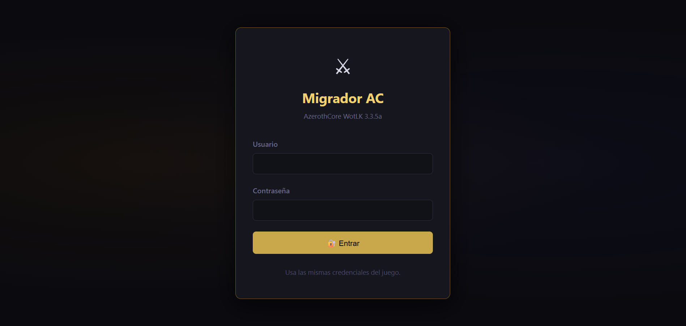

# ⚔ Migrador de Personajes — AzerothCore

Herramienta web para migrar personajes hacia un servidor **AzerothCore WotLK 3.3.5a**.  
Versión actualizada y modernizada desde el repositorio original:  
[azerothcore/web-character-migration-tool](https://github.com/azerothcore/web-character-migration-tool)

> **PHP 8.5.7 ya está incluido** en la carpeta `php/`. No necesitas instalar nada adicional.



---

## Inicio rápido

1. Importa las tablas SQL (solo la primera vez):
   ```
   mysql -u acore -p acore_auth < sql/install.sql
   ```
2. Copia `config.example.php` a `config.php` y edita tus credenciales de base de
   datos y SOAP. `config.php` está en `.gitignore` para que no acabe en el repo.
3. Doble clic en **`Iniciar.bat`** — levanta el servidor y abre el navegador automáticamente en `http://localhost:8080`.
4. Para detenerlo: cierra la ventana de consola o ejecuta **`Detener.bat`**.

---

## 📋 Requisitos

| Componente | Estado |
|-----------|--------|
| PHP 8.5.7 | **Incluido** en `php/` — no requiere instalación |
| MySQL 8.0+ / MariaDB 10.5+ | Requerido (AzerothCore) |
| AzerothCore | Última revisión (`acore_auth` / `acore_characters`) |
| Addon WoW | `chardump` (incluido en `addon/chardump/`) |
| DBC | `server/dbc/ItemDisplayInfo.dbc` (para íconos de items) |

---

## 🚀 Instalación

### 1. Base de datos

```bash
mysql -u acore -p acore_auth < sql/install.sql
```

Crea:
- `account_transfer` — registro de todas las transferencias
- `account_transfer_blacklist` — cuentas bloqueadas
- `v_transfer_summary` — vista de resumen para reportes
- `migrador_login_attempts` — intentos de login fallidos, para el rate limiting por IP

### 2. Configuración

Copia la plantilla y edita **tu** copia:

```bash
cp config.example.php config.php
```

```php
define('DB_AUTH_HOST', '127.0.0.1');
define('DB_AUTH_USER', 'acore');
define('DB_AUTH_PASS', 'acore');
define('DB_AUTH_NAME', 'acore_auth');

define('REALMS', [
    1 => [
        'name'      => 'Mi Servidor',
        'db_name'   => 'acore_characters',
        'soap_host' => '127.0.0.1',
        'soap_port' => 7878,
        'soap_user' => 'admin',
        'soap_pass' => 'admin',
        'soap_uri'  => 'urn:AC',   // ← AC usa urn:AC (no urn:TC)
    ],
]);
```

### 3. Cómo se importa

El migrador no escribe personajes en la base de datos si puede evitarlo. Hay dos
caminos y los elige solo, según si el worldserver del realm responde:

**Worldserver encendido → `.pdump load` por SOAP.** El migrador genera un fichero
en el formato de `.pdump write` y le pide al core que lo cargue. `PlayerDumpReader`
reasigna los GUID con sus propios generadores, refresca el `CharacterCache` y
actualiza el contador de personajes de la cuenta. Todo lo hace el core, así que no
hay nada que pueda colisionar.

**Worldserver apagado → `INSERT` directo.** Ahí no hay con quién hablar, y como
nadie más está repartiendo GUID el camino directo es seguro.

Por qué importa: `ObjectMgr::SetHighestGuids()` se ejecuta una sola vez al
arrancar. El core lee `MAX(guid)` de `characters` e `item_instance`, y a partir de
ahí reparte GUID desde memoria. Escribir en la DB con `MAX(guid)+1` mientras el
servidor corre significa quedarse con GUID que ya tiene reservados: el siguiente
personaje creado en el juego, o cada item looteado, choca contra la clave
primaria. Con `mail.id` pasa lo mismo, que tampoco es `AUTO_INCREMENT`.

El fichero del pdump **lo abre el worldserver, no la web**. Si están en máquinas
distintas, apunta `PDUMP_PATH` a una ruta que los dos vean con el mismo nombre:

```php
define('PDUMP_PATH', '');   // vacío = storage/pdump/
```

Se borra en cuanto el core termina de leerlo.

> Un detalle del core: si el nombre ya está cogido, `.pdump load` importa el
> personaje con otro nombre y lo marca para renombrar en el primer login. El
> migrador no puede saber cuál le tocó, así que en ese caso da error y el GM
> vuelve a intentarlo con otro nombre.

### 4. Worldserver — Habilitar SOAP

En `worldserver.conf`:

```ini
SOAP.Enabled  = 1
SOAP.IP       = 127.0.0.1
SOAP.Port     = 7878
```

### 5. Pre-cachear íconos (recomendado)

Primero asegúrate de que `DBC_PATH` en `config.php` apunte a la carpeta que contiene `ItemDisplayInfo.dbc`:

```php
define('DBC_PATH', 'C:/AzerothCoreRepack/server/dbc');  // ← ajusta esta ruta
```

Luego ejecuta una sola vez:

```bash
php api/precache_icons.php
```

O desde el navegador, **con una sesión de GM abierta**:
`http://localhost:8080/api/precache_icons.php`

Procesa los ~46 000 items de `item_template` en ~75 s y genera `storage/icon_cache/`.
Lleva `set_time_limit(0)`: por navegador se cortaba a los 30 s de
`max_execution_time` a media faena.  
Para forzar reconstrucción: `?reset=1`

> `ItemDisplayInfo.dbc` lo extrae AzerothCore automáticamente con el extractor de datos del cliente de WoW.

---

## 🔑 Cómo iniciar sesión

Los jugadores usan las **mismas credenciales del juego** (cuenta de AzerothCore).
La verificación es **SRP6** contra `acore_auth.account` (`salt` + `verifier`), igual
que hace el propio authserver en las revisiones actuales de AzerothCore. Requiere la
extensión `gmp`, ya incluida en el PHP de `php/`.

---

## 🗺 Flujo de transferencia

```
Jugador                    Web                      GM
   │                        │                        │
   │── Login ──────────────>│                        │
   │── Paso 1: sube dump ──>│ Valida formato JSON    │
   │<── Paso 2: Character ──│ Paperdoll + íconos     │
   │      Sheet preview     │                        │
   │── Confirma nombre ────>│ Aplica dump en DB      │
   │                        │── notifica ───────────>│
   │                        │<── Aprobar/Denegar ────│
   │<── personaje listo ────│                        │
```

---

## ✅ Qué hace la importación (al aprobar una transferencia)

Además de crear el personaje con su equipo/bolsas/banco/spells/reputaciones tal
cual vienen en el dump, `CharacterImporter` completa automáticamente lo que un
personaje insertado directo en la DB nunca recibe (por saltarse
`Player::Create()`):

- **Barra de acciones** — se rellena con el layout por defecto de su
  raza/clase (`playercreateinfo_action`), en vez de quedar vacía.
- **Skills de arma/armadura/defensa al máximo (400)** — leídos de
  `playercreateinfo_skills` (misma tabla que usa el core), sin adivinar
  ningún id a mano.
- **Plate Mail para Guerrero/Paladín** — caso especial: esa proficiency no
  está en `playercreateinfo_skills` para esas 2 clases (se consigue más
  adelante en el juego, no "de fábrica"); Death Knight sí la tiene de
  fábrica y no necesita el caso especial.
- **Profesiones a 400** — si el dump trae alguna (Alquimia, Herrería, etc.),
  se sube a su tope en vez de dejar el valor original.
- **Talentos reseteados con todos los puntos libres** — `at_login` se deja en 5
  (`AT_LOGIN_RENAME | AT_LOGIN_RESET_TALENTS`), así que el core los resetea en el
  primer login y además pide confirmar el nombre. No vale la pena insertar un build
  a mano: no hay forma confiable de validar esos ids por SQL en una instalación
  típica, y uno inválido puede tirar abajo el worldserver.
- **`exploredZones`/`knownTitles` con el formato correcto** — el core
  exige exactamente 128 y 6 enteros respectivamente o descarta el campo
  entero como inválido; un `NULL` directo generaba warnings en cada login.
- **Cada item vuelve a su sitio** — el dump trae la posición original (mochila,
  bolsa equipada N, banco), así que los items entran en su slot y **dentro de sus
  bolsas**, no amontonados en la mochila. Un personaje con 4 bolsas de 32 tiene
  144 huecos en vez de 16, y solo lo que pase de ahí va por correo.
- **Quests en curso** — `character_queststatus` con las del log: completas con
  status 1, en curso con 3. El addon no exporta el progreso de cada objetivo, así
  que las incompletas empiezan con los contadores a cero. Los ids se validan
  contra `quest_template`.
- **Items con su durabilidad completa** — `item_instance.durability` se rellena con
  el `MaxDurability` de `item_template`. `Item::LoadFromDB` solo corrige la
  durabilidad si supera el máximo, así que un 0 se quedaba en 0 y el personaje
  entraba con todo el equipo roto.
- **Gemas en los sockets correctos** — slots 2, 3 y 4 de `enchantments`
  (`SOCK_ENCHANTMENT_SLOT` en `Item.h`). El slot 1 es el encantamiento temporal, y
  usarlo desplazaba las tres gemas dejando el último socket vacío.
- **Correos troceados a 12 adjuntos** — el límite del cliente
  (`MAX_MAIL_ITEMS`). Además `mail.id` se genera a mano: no es `AUTO_INCREMENT`, así
  que `lastInsertId()` devolvía 0 y el segundo correo chocaba con la clave primaria.
- **`cinematic = 1`** — no dispara el video de introducción de la raza.
- **Reconocimiento inmediato por el servidor** — se llama `.cache refresh
  <nombre>` por SOAP apenas termina el import, para que el personaje no
  aparezca como "entidad desconocida" en chat/`/who`/nameplates hasta que
  alguien reinicie el worldserver (el core solo actualiza ese caché en
  memoria en las creaciones normales de personaje).

- **Nombre libre en el momento de insertar** — `characters.name` solo tiene un
  índice normal, no `UNIQUE`, así que la DB no impide duplicados. Entre que el
  jugador confirma el nombre y el GM aprueba pueden pasar días, y el import
  directo lo vuelve a comprobar antes de escribir. Por la vía del pdump se ocupa
  el core.

Todo esto se construye igual por los dos caminos: el importador llena un
`ImportBuffer` con las filas, y luego se escriben como `INSERT` (`DirectWriter`) o
se serializan a un pdump (`PdumpWriter`). Así no hay dos implementaciones que
puedan separarse.

> **Requiere `SOAP.Enabled = 1`** en `worldserver.conf` para importar con el
> servidor encendido y para el reenvío de items por correo.

> **Multi-realm**: el chequeo de GM (`User::gmLevel()` / `getGMLevel()`)
> reconoce el `RealmID` de cada realm definido en `REALMS` (config.php), no
> solo el 1 — una cuenta GM asignada únicamente a otro realm ya no queda
> bloqueada del panel de aprobación.

---

## 📁 Estructura del proyecto

```
Migrador/
├── Iniciar.bat                 ← Doble clic: inicia servidor + abre navegador
├── Detener.bat                 ← Detiene el servidor PHP
├── router.php                  ← Headers de seguridad + bloqueo storage//.sql,
│                                  ya que `php -S` no aplica `.htaccess`
├── set_lang.php                ← Cambia el idioma activo (guardado en sesión)
├── config.example.php          ← Plantilla: cópiala a config.php
├── config.php                  ← Tu configuración (gitignored)
├── index.php                   ← Login
├── dashboard.php               ← Panel jugador / GM
├── logout.php                  ← Cerrar sesión
├── .htaccess                   ← Seguridad Apache (si usas Apache en vez de Iniciar.bat)
│
├── php/                        ← PHP 8.5.7 auto-contenido (no tocar)
│   ├── php.exe
│   ├── php.ini                 ← Configurado con extensiones necesarias
│   └── ext/                    ← pdo_mysql, soap, openssl, mbstring, etc.
│
├── api/
│   ├── icon.php                ← Proxy de íconos on-demand
│   └── precache_icons.php      ← Pre-cachea íconos de todo item_template
│
├── classes/
│   ├── CharacterImporter.php   ← Parseo e importación de dumps JSON/Lua
│   ├── DB.php                  ← PDO singleton (auth + chars multi-realm)
│   ├── User.php                ← Autenticación SHA1 compatible con AC
│   ├── Token.php               ← CSRF (random_bytes, hash_equals)
│   ├── Session.php             ← Flash messages y helpers
│   ├── Input.php               ← Entrada segura POST/GET
│   ├── Validation.php          ← Validación de formularios
│   ├── Soap.php                ← Cliente SOAP para worldserver (urn:AC)
│   ├── ImportBuffer.php        ← Filas del import, antes de escribirlas
│   ├── DirectWriter.php        ← Las escribe con INSERT (servidor apagado)
│   ├── PdumpWriter.php         ← Las serializa para `.pdump load`
│   └── RateLimiter.php         ← Bloqueo temporal de login por IP
│
├── transfer/
│   ├── language.php            ← Traducciones (es/en/fr/de/ru/pt) + selector de idioma
│   ├── functions.php           ← Lógica de transferencia
│   ├── dbfunctions.php         ← Operaciones DB
│   ├── step1.php               ← Subir chardump
│   ├── step2.php               ← Character Sheet preview + confirmar nombre
│   ├── b_approve.php           ← GM: aprobar
│   ├── b_deny.php              ← GM: denegar
│   ├── b_cancel.php            ← Jugador: cancelar
│   └── b_resend.php            ← GM: reenviar items por mail
│
├── addon/
│   └── chardump/               ← Addon WoW para exportar personajes
│       ├── chardump.lua
│       └── chardump.toc
│
├── tests/
│   ├── import_test.php         ← Test de integración contra MySQL
│   └── PdumpParser.php         ← Réplica del parser del core, para validar
│
├── sql/
│   └── install.sql             ← Crear tablas (ejecutar una sola vez)
│
├── storage/
│   └── icon_cache/             ← Caché de íconos (generada automáticamente)
│       ├── _dbc_index.json     ← Índice displayid → iconName (~42 000 entradas)
│       └── <entry>.txt         ← Un archivo por item con el nombre del ícono
│
└── assets/
    ├── css/style.css           ← Tema oscuro WoW
    └── js/app.js               ← Interactividad
```

---

## 🖼 Character Sheet (paso 2)

El paso de confirmación muestra un **panel visual completo** del personaje antes de enviar la solicitud:

- **Cabecera** — nombre, nivel, raza, género, clase con su color oficial
- **Grid 3 columnas** — 16 slots de equipamiento (68 × 68 px) con ícono, borde de calidad y nombre
- **Barra de armas** — mano principal, mano secundaria, a distancia/reliquia
- **Barra de bolsas** — bolsas equipadas (52 × 52 px)
- **Stats** — oro, honor, arena points, items en mochila/banco, spells, talentos, glifos
- **Enlace WoWHead** — abre el vestidor de WoWHead con los items del personaje

### Sistema de íconos

```
entry ──> api/icon.php ──> storage/icon_cache/<entry>.txt ──> CDN WoWHead
                               (hit: <1 ms)
                           Si no existe:
                           item_template → ItemDisplayInfo.dbc → nombre de ícono
```

---

## 🔄 Cambios respecto al original

| Aspecto | Original | Esta versión |
|---------|----------|-------------|
| PHP     | 5.3-7.x  | **8.5.7** (incluido) |
| Servidor | Apache/Nginx externo | **PHP built-in server** vía `Iniciar.bat` |
| DB      | `auth` / `characters` | **`acore_auth`** / **`acore_characters`** |
| SOAP URI | `urn:TC` | **`urn:AC`** |
| SQL     | Concatenación directa | **PDO + prepared statements** |
| CSRF    | `md5(uniqid())` | **`random_bytes(32)`** + `hash_equals` |
| Sesiones | Cookie básica | `httponly + samesite=Lax + secure` |
| UI      | Tablas HTML 4 + inline styles | **HTML5 + CSS Grid + tema oscuro WoW** |
| account_access | `gmlevel` en `account` | **`account_access.gmlevel`** |
| Errores | `die("SHIT HAPPENS")` | **Flash messages + `php/php_errors.log`** |
| php.ini | El de desarrollo | **Sin `display_errors` ni trazas con argumentos** |
| Paso 2 | Formulario de nombre | **Character Sheet visual** con íconos, calidades y stats |
| Íconos | Ninguno | **DBC local** → caché de archivo → CDN WoWHead |
| Formato de dump | SQL ejecutado con `exec()` | **JSON validado campo a campo** |
| GUIDs | `MAX(guid)+1` a ciegas | **Los reparte el core** vía `.pdump load` |
| Inventario | Todo a la mochila, resto a correo | **Cada item en su slot y dentro de su bolsa** |
| Quests | No se importaban | **`character_queststatus`** validado contra `quest_template` |
| Tests | Ninguno | **`tests/import_test.php`** contra MySQL |

---

## 🛡 Seguridad implementada

- **CSRF** tokens en todos los formularios (uso único, `random_bytes`)
- **PDO prepared statements** en todas las queries
- **Validación** de tipos y rangos en servidor
- **Sesiones** con `httponly`, `samesite=Lax`, regeneración en login
- **Acceso por rol**: GMs ven panel completo; jugadores solo sus transferencias
- **Verificación de propiedad**: jugadores solo cancelan sus propias transferencias
- **Límite de tamaño** en uploads (5 MB). `upload_max_filesize` venía en `2M`, por
  debajo de lo que valida el código, así que un dump de entre 2 y 5 MB moría en PHP
  antes de llegar al chequeo y salía como "archivo inválido" en vez de "demasiado
  grande"
- **`router.php`** — el servidor que arranca `Iniciar.bat` es el *built-in server*
  de PHP (`php -S`), que **no lee `.htaccess`** (eso es exclusivo de Apache). El
  router aplica en cada request los headers de seguridad (`X-Frame-Options`,
  `X-Content-Type-Options`, `X-XSS-Protection`, `Referrer-Policy`) y bloquea con
  403 el acceso directo a `/storage/` y a archivos `.sql`, `.log`, `.bak`, `.env`,
  `.ini` — protecciones que antes solo existían en `.htaccess` y nunca se
  aplicaban en la práctica. El patrón de `/storage/` va con `/i`: en Windows el
  filesystem no distingue mayúsculas, así que `GET /Storage/…` servía el archivo.
- **`php/php.ini` endurecido** — venía el de desarrollo, con `display_errors` y
  `display_startup_errors` encendidos y `zend.exception_ignore_args` apagado. Eso
  volcaba al navegador del visitante cualquier error con su traza, rutas absolutas
  del servidor incluidas, **y los argumentos de cada llamada**: una excepción
  dentro de `User::login()` imprimía la contraseña del jugador. Ahora los errores
  van a `php/php_errors.log` y no a pantalla, `expose_php` está en `Off` y
  `session.use_strict_mode` en `1` (fijación de sesión). Las contraseñas van
  además con `#[SensitiveParameter]`, que PHP tacha en las trazas.
- **Los proxies del visor 3D y de íconos piden sesión** (`api/model_proxy.php`,
  `api/wotlk_display.php`, `api/icon.php`) y verifican el certificado TLS. Antes
  eran anónimos, escribían en disco y traían el contenido sin verificar el
  certificado.
- **El reenvío de items saca el personaje de la transferencia**, no del POST: un
  GM podía reenviarse por correo los items de cualquier personaje del servidor.
- **Redirecciones sin `Host`** — el login y el paso 2 construían la URL de destino
  con `$_SERVER['HTTP_HOST']`, que elige el cliente, y el login además lo
  interpolaba sin escapar dentro de un `<script>`. Ahora son rutas relativas.
- **`set_lang.php`** rechaza también las rutas con barra invertida: los navegadores
  la tratan como una barra normal, así que `/\evil.com` acababa siendo un redirect
  externo.
- **Solo se aceptan dumps JSON (chardump v2)**, que `CharacterImporter` reconstruye
  campo a campo. El formato v1 pasaba el dump del jugador a `PDO::exec()` troceado
  por `;`, y el "cifrado" del addon es un base64 invertido: cualquiera podía
  fabricar un dump con statements extra (por ejemplo un `INSERT` en
  `account_access`) y le bastaba con que un GM pulsara Aprobar.
- **`api/precache_icons.php` exige sesión de GM** desde el navegador. Sin eso,
  cualquiera podía lanzar ~46 000 lookups y otras tantas escrituras por request, y
  `?reset=1` borraba la caché para que no hubiera atajo.
- **Rate limiting de login** (`classes/RateLimiter.php`) — bloquea una IP
  durante 15 minutos tras 5 intentos fallidos en una ventana de 15 minutos
  (tabla `migrador_login_attempts` en `acore_auth`). El cálculo del tiempo
  restante se hace enteramente en SQL (`TIMESTAMPDIFF`) para evitar un desfase
  si PHP y MySQL no comparten zona horaria.

---

## 🌐 Idiomas soportados

`es` · `en` · `fr` · `de` · `ru` · `pt` — selector de idioma en la UI (login,
dashboard y ambos pasos de transferencia) que guarda la elección en sesión y
recarga la página automáticamente al cambiar. Cubre tanto los textos de la
interfaz como el vocabulario del preview de personaje (stats, clases/razas,
tipos de daño, sockets, triggers de hechizo, nombres de slot de equipo).  
Cambia `DEFAULT_LANG` en `config.php` para ajustar el idioma por defecto
cuando el jugador no eligió ninguno.

---

## 🧪 Test de integración

```bash
php tests/import_test.php
```

Crea dos bases de prueba copiando el esquema de tu instalación
(`mcac_test_auth` / `mcac_test_chars`), importa los dumps de `storage/` y
comprueba el resultado fila a fila: posiciones del inventario, durabilidad,
slots de gemas, skills, quests, troceado de correos, rollback de un dump
inválido e integridad de GUIDs. Al terminar las borra; con `--keep` las deja
para mirarlas.

Para el pdump no hace falta un worldserver: `tests/PdumpParser.php` replica
`GetTableName`, `ValidateFields` y `FindColumn` de `PlayerDump.cpp`, así que el
test afirma que el core aceptaría el fichero y que cada columna se lee en la
posición correcta. Eso es lo que hay que comprobar, porque el formato resuelve las
columnas por índice y un fichero que parece bien puede hacer que el core lea el
valor de al lado.

No toca tus bases reales: de `acore_world` solo lee.

---

## 📜 Licencia

GPL v2 — Compatible con AzerothCore, TrinityCore, MaNGOS.  
Créditos originales: MasterkinG32, AzerothCore Team.
